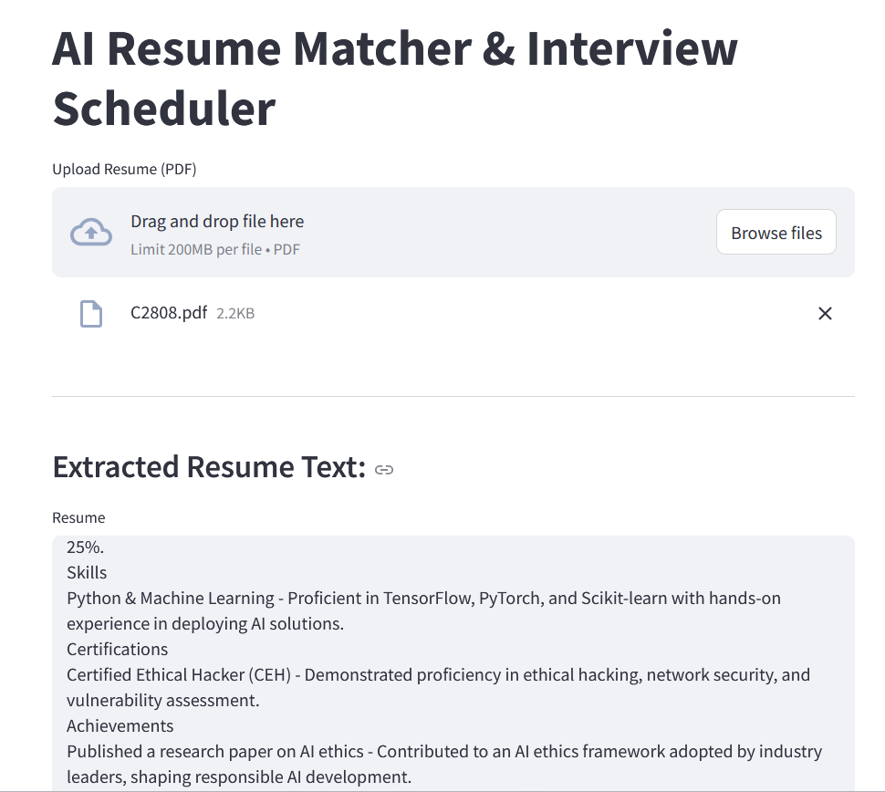
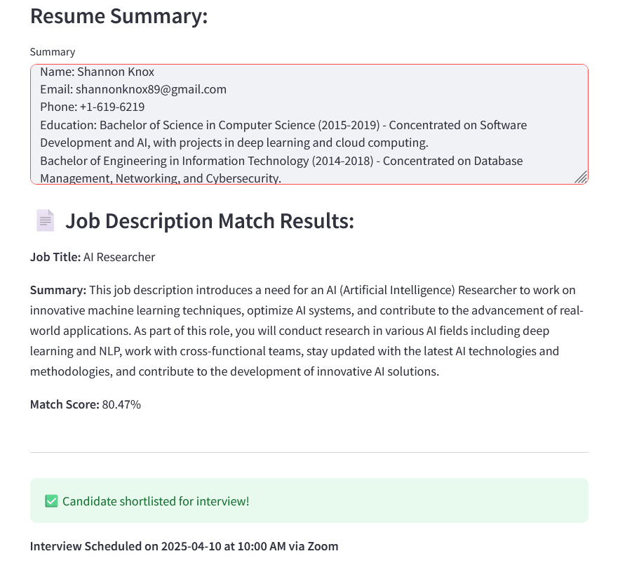

# 🧠 AI-Powered Resume Matcher & Interview Scheduler

This project is a streamlined recruitment tool that leverages Large Language Models (LLMs), semantic search, and vector databases to **match candidate resumes with job descriptions**, **shortlist the best fits**, and **automatically schedule interviews** — all within a simple Streamlit interface.


<div style="display: flex; justify-content: space-between;">
  
  
</div>

---
## 📑 Table of Contents
- [Features](#-features)
- [Project Structure](#-project-structure)
- [Installation](#-installation)
- [How It Works](#-how-it-works)

## 🚀 Features

- 📄 **Summarize Job Descriptions** using TinyDolphin (LLM)
- 📌 **Semantic Embedding** of job summaries and resumes using `mxbai-embed-large`
- 🎯 **FAISS-based Similarity Search** to match resumes with job descriptions
- 🧮 **Embedding Normalization** for efficient and consistent similarity scores
- ✅ **Automatic Shortlisting** based on match score (≥ 80%)
- 📅 **Interview Scheduler** with name/email extraction from resume
- 💾 **SQLite Database** to store JDs, resume matches, and interview schedules
- 🧑‍💻 **Streamlit UI** for interactive resume uploads and results

---

## 📁 Project Structure
- `main.py`: Handles job description processing.
- `app.py`: Streamlit app for user interaction.
- `recruitment.db`: SQLite database storing job descriptions, resume matches, and interview schedules.
- `requirements.txt`: Dependencies for the project.


## ⚙️ Installation
### 1. Clone the repository
```bash
git clone https://github.com/Madhavmurari/Resume-Matching-AI-Agent.git
cd Resume-Matching-AI-Agent
```
### 2.Create and activate a virtual environment
```bash
python -m venv venv
venv\Scripts\activate
```
### 3. Install dependencies
```bash
./build.sh
```
### 4.1 Run Ollama model locally
```bash
ollama run tinydolphin
ollama run mxbai-embed-large

```
### 4.2 Run the job processing script
```bash
python main.py
```
### 5. Launch the Streamlit app
```bash
streamlit run app.py
```
## 🧪 How It Works
📌 Recruiter(main.py)
Add job descriptions to the database.

Each JD is summarized using TinyDolphin.

The summary is embedded using mxbai-embed-large and normalized.

FAISS builds an index, stored alongside JDs in recruitment.db.

📂 Candidate Flow (app.py)
Upload a resume (PDF).

Resume is extracted, summarized, embedded, and normalized.

FAISS performs similarity search to find best-matching JDs.

If match score ≥ 80%, candidate is shortlisted and interview is scheduled.

## 🔐 License
This project is licensed under the MIT License. See [LICENSE](LICENSE) for details.
